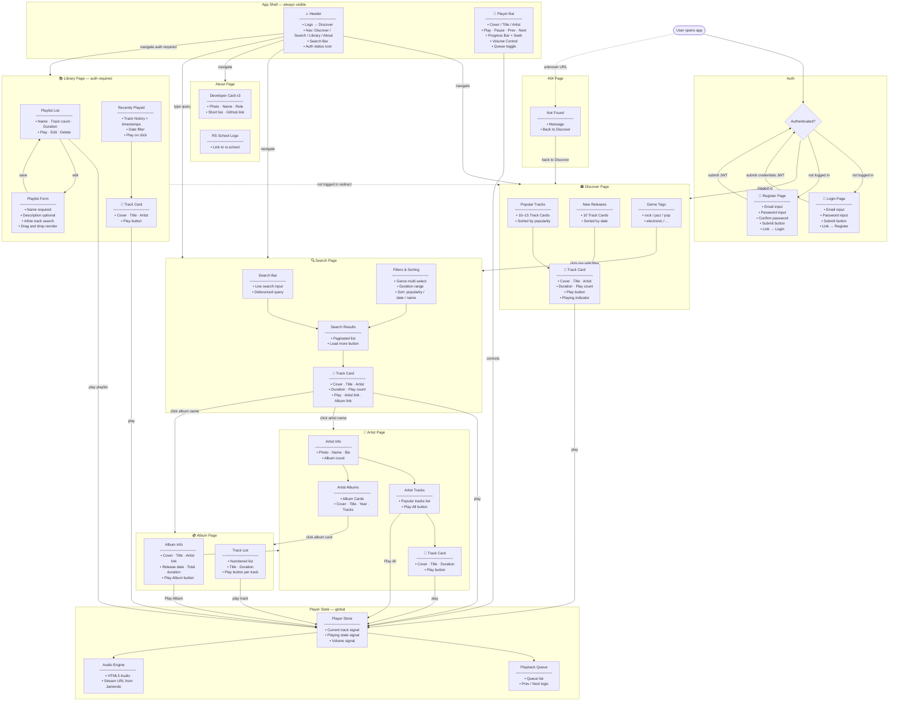

# InjecTune — Component Relationship Diagram

```mermaid
graph TD
    subgraph AppShell [App Shell — always visible]
        Header["🔝 Header
        ──────────────
        • Logo → Discover
        • Nav: Discover / Search / Library / About
        • Search Bar
        • Auth status icon"]
        PlayerBar["🎵 Player Bar
        ──────────────
        • Cover / Title / Artist
        • Play · Pause · Prev · Next
        • Progress Bar + Seek
        • Volume Control
        • Queue toggle"]
    end

    subgraph AuthPages [Auth]
        AuthGuard{Authenticated?}
        LoginPage["🔐 Login Page
        ──────────────
        • Email input
        • Password input
        • Submit button
        • Link → Register"]
        RegisterPage["📝 Register Page
        ──────────────
        • Email input
        • Password input
        • Confirm password
        • Submit button
        • Link → Login"]
    end

    subgraph DiscoverPage [📻 Discover Page]
        PopularTracks["Popular Tracks
        ──────────────
        • 10–15 Track Cards
        • Sorted by popularity"]
        NewReleases["New Releases
        ──────────────
        • 10 Track Cards
        • Sorted by date"]
        GenreTags["Genre Tags
        ──────────────
        • rock / jazz / pop
        • electronic / ..."]
        TrackCardDiscover["🎵 Track Card
        ──────────────
        • Cover · Title · Artist
        • Duration · Play count
        • Play button
        • Playing indicator"]
    end

    subgraph SearchPage [🔍 Search Page]
        SearchBar["Search Bar
        ──────────────
        • Live search input
        • Debounced query"]
        SearchFilters["Filters & Sorting
        ──────────────
        • Genre multi-select
        • Duration range
        • Sort: popularity / date / name"]
        SearchResults["Search Results
        ──────────────
        • Paginated list
        • Load more button"]
        TrackCardSearch["🎵 Track Card
        ──────────────
        • Cover · Title · Artist
        • Duration · Play count
        • Play · Artist link · Album link"]
    end

    subgraph ArtistPage [🎤 Artist Page]
        ArtistInfo["Artist Info
        ──────────────
        • Photo · Name · Bio
        • Album count"]
        ArtistTracks["Artist Tracks
        ──────────────
        • Popular tracks list
        • Play All button"]
        ArtistAlbums["Artist Albums
        ──────────────
        • Album Cards
        • Cover · Title · Year · Tracks"]
        TrackCardArtist["🎵 Track Card
        ──────────────
        • Cover · Title · Duration
        • Play button"]
    end

    subgraph AlbumPage [💿 Album Page]
        AlbumInfo["Album Info
        ──────────────
        • Cover · Title · Artist link
        • Release date · Total duration
        • Play Album button"]
        AlbumTracks["Track List
        ──────────────
        • Numbered list
        • Title · Duration
        • Play button per track"]
    end

    subgraph LibraryPage [📚 Library Page — auth required]
        PlaylistList["Playlist List
        ──────────────
        • Name · Track count · Duration
        • Play · Edit · Delete"]
        PlaylistForm["Playlist Form
        ──────────────
        • Name required
        • Description optional
        • Inline track search
        • Drag and drop reorder"]
        RecentlyPlayed["Recently Played
        ──────────────
        • Track history + timestamps
        • Date filter
        • Play on click"]
        TrackCardLibrary["🎵 Track Card
        ──────────────
        • Cover · Title · Artist
        • Play button"]
    end

    subgraph AboutPage [About Page]
        DeveloperCard["Developer Card x3
        ──────────────
        • Photo · Name · Role
        • Short bio · GitHub link"]
        RSSchoolLogo["RS School Logo
        ──────────────
        • Link to rs.school"]
    end

    subgraph PlayerState [Player State — global]
        PlayerStore["Player Store
        ──────────────
        • Current track signal
        • Playing state signal
        • Volume signal"]
        PlayerQueue["Playback Queue
        ──────────────
        • Queue list
        • Prev / Next logic"]
        AudioEngine["Audio Engine
        ──────────────
        • HTML5 Audio
        • Stream URL from Jamendo"]
    end

    subgraph NotFoundPage [404 Page]
        NotFound["Not Found
        ──────────────
        • Message
        • Back to Discover"]
    end

    %% Entry point
    App([User opens app]) --> AuthGuard

    %% Auth flow
    AuthGuard -- not logged in --> LoginPage
    AuthGuard -- not logged in --> RegisterPage
    AuthGuard -- logged in --> DiscoverPage
    LoginPage -- submit credentials JWT --> AuthGuard
    RegisterPage -- submit JWT --> AuthGuard

    %% Header navigation
    Header -- navigate --> DiscoverPage
    Header -- navigate --> SearchPage
    Header -- navigate --> AboutPage
    Header -- type query --> SearchPage
    Header -- navigate auth required --> LibraryPage
    LibraryPage -. not logged in redirect .-> DiscoverPage

    %% Discover page
    PopularTracks --> TrackCardDiscover
    NewReleases --> TrackCardDiscover
    GenreTags -- click tag with filter --> SearchPage
    TrackCardDiscover -- play --> PlayerStore

    %% Search page
    SearchBar --> SearchResults
    SearchFilters --> SearchResults
    SearchResults --> TrackCardSearch
    TrackCardSearch -- play --> PlayerStore
    TrackCardSearch -- click artist name --> ArtistPage
    TrackCardSearch -- click album name --> AlbumPage

    %% Artist page
    ArtistInfo --> ArtistTracks
    ArtistInfo --> ArtistAlbums
    ArtistTracks --> TrackCardArtist
    TrackCardArtist -- play --> PlayerStore
    ArtistTracks -- Play All --> PlayerStore
    ArtistAlbums -- click album card --> AlbumPage

    %% Album page
    AlbumInfo -- click artist name --> ArtistPage
    AlbumInfo -- Play Album --> PlayerStore
    AlbumTracks -- play track --> PlayerStore

    %% Player Bar
    PlayerBar -- controls --> PlayerStore
    PlayerStore --> PlayerQueue
    PlayerStore --> AudioEngine

    %% Library page
    PlaylistList -- play playlist --> PlayerStore
    PlaylistList -- edit --> PlaylistForm
    PlaylistForm -- save --> PlaylistList
    RecentlyPlayed --> TrackCardLibrary
    TrackCardLibrary -- play --> PlayerStore

    %% Unknown route
    App -. unknown URL .-> NotFound
    NotFound -- back to Discover --> DiscoverPage
```
